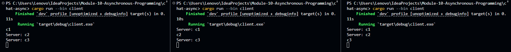
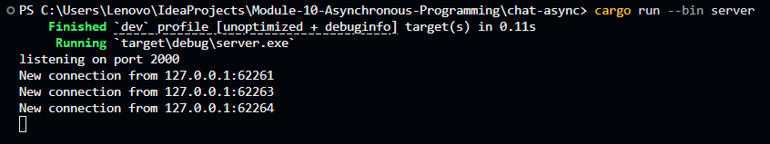

# Tutorial 2: Broadcast Chat
## 2.1 Original code of broadcast chat
### Simple WebSocket Chat Application
This project implements a basic chat system using Rust and WebSockets. To see the application in action, you can follow these steps:
#### How to Run
1. Start the Server: Open your terminal and run the command cargo run --bin server. The server will start listening for incoming connections on port 2000.
2. Start the Clients: Open three separate terminal windows and run cargo run --bin client in each one. This will create three distinct client connections as seen in the server logs.
3. Communication: Once connected, you can type any text in any of the client terminals and press Enter.
#### Screenshots

#### What Happens
When a client sends a message (for example, typing "c1" in the first client), the server receives the data and broadcasts it to all other connected clients using the tokio::broadcast channel. Based on the screenshots, when "c1" is typed in Client 1, it appears as "Server: c1" in the terminals of Client 2 and Client 3. This implementation ensures real-time communication between multiple users. Furthermore, thanks to the logic added in handle_connection, the sender does not receive an echo of their own message, keeping the chat interface clean and intuitive.