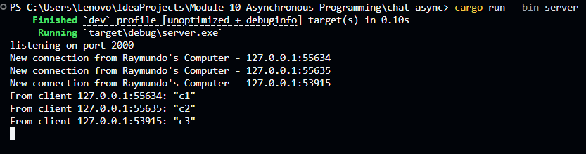
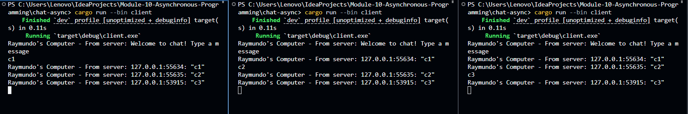

# Tutorial 2: Broadcast Chat

## 2.1 Original code of broadcast chat

### Simple WebSocket Chat Application
This project implements a basic chat system using Rust and WebSockets. To see the application in action, you can follow these steps:

### How to Run
1. Start the Server: Open your terminal and run the command cargo run --bin server. The server will start listening for incoming connections on port 2000.
2. Start the Clients: Open three separate terminal windows and run cargo run --bin client in each one. This will create three distinct client connections as seen in the server logs.
3. Communication: Once connected, you can type any text in any of the client terminals and press Enter.

### Screenshots


### What Happens
When a client sends a message (for example, typing "c1" in the first client), the server receives the data and broadcasts it to all other connected clients using the tokio::broadcast channel. Based on the screenshots, when "c1" is typed in Client 1, it appears as "Server: c1" in the terminals of Client 2 and Client 3. This implementation ensures real-time communication between multiple users. Furthermore, thanks to the logic added in handle_connection, the sender does not receive an echo of their own message, keeping the chat interface clean and intuitive.

## 2.2. Modifying the websocket port
To further understand how the client-server architecture works, the connection port was modified from `2000` to `8080`.

### 2.2.1 Port Modification on Client Side
The port was first changed in `src/bin/client.rs` as follows:
```rust
let (mut ws_stream, _) =
    ClientBuilder::from_uri(Uri::from_static("ws://127.0.0.1:8080"))
        .connect()
        .await?;
```

### 2.2.2 Connection Refused Error
When running the client while the server was still listening on port `2000`, the following error occurred:
`Error: Io(Os { code: 10061, kind: ConnectionRefused, message: "No connection could be made because the target machine actively refused it." })`

**Why did this happen?**  
In network programming, a connection requires a match between the "Listener" (Server) and the "Dialer" (Client). Since the server was still bound to port `2000`, it was not "listening" for any traffic on port `8080`, causing the operating system to reject the client's request.

### 2.2.3 The Solution: Synchronizing Both Sides
To fix this, the server-side code in `src/bin/server.rs` must be updated to match the client's port:
```rust
let listener = TcpListener::bind("127.0.0.1:8080").await?;
println!("listening on port 8080");
```
Once both sides were configured to use port `8080`, the communication was restored, and the application ran perfectly.

### 2.2.4 Protocol and Definition
Both the client and server use the **WebSocket protocol**. 
- It is explicitly defined on the **client side** via the `ws://` prefix in the URI string.
- On the **server side**, the protocol is handled by the `tokio_websockets` crate, which performs a "handshake" to upgrade the raw TCP stream (from `TcpListener`) into a `WebSocketStream`. 

Both files must use the same protocol and port to successfully establish a handshake and exchange messages.

## 2.3. Small changes. Add some information to client
In this task, to provide better context for each message, the application was modified to display a custom identifier and also the IP address and port of the sender for every message broadcasted by the server. This helps users distinguish who is sending which message in the chat.

### 2.3.1 Code Modifications

### 2.3.1.1 Server Side (`src/bin/server.rs`)
The `server.rs` was modified to intercept the raw message from a client and wrap it with that client's `SocketAddr`. Instead of broadcasting just the message body, the server now broadcasts a formatted string: `addr: message`. This ensures that every client in the network receives the same identifiable information.
```rust
let formatted_msg = format!("{}: {}", addr, text);
let _ = bcast_tx.send(formatted_msg);
```
**Why here?** The server is the "central hub." Since it already possesses the `addr` (SocketAddr) of every connected client through the `handle_connection` parameters, it is the most efficient place to attach metadata to the message before it reaches other participants.

### 2.3.1.1 Client Side (`src/bin/client.rs`)
The client was updated to prepend the received string with a custom tag. When a message is received from the server's broadcast, it is printed using:
```rust
println!("Raymundo's Computer - From server: \"{}\"", text);
```
**Why here?** This modification ensures that the UI/UX matches the requirement, clearly indicating that the information is being received from the server's broadcast stream.

### Screenshots



### 2.3.2 How it Works
1. When **Client A** (e.g., `127.0.0.1:49838`) types "hi", it sends only the string "hi" to the server.
2. The server receives "hi", sees it came from `127.0.0.1:49838`, and creates a new string: `127.0.0.1:49838: "hi"`.
3. The server broadcasts this new string to **Client B**, **Client C**, and even back to **Client A**.
4. All clients display: `Raymundo's Computer - From server: 127.0.0.1:49838: "hi"`.

This demonstrates how the server acts as a mediator that can manipulate data packets to provide context to all connected peers.
